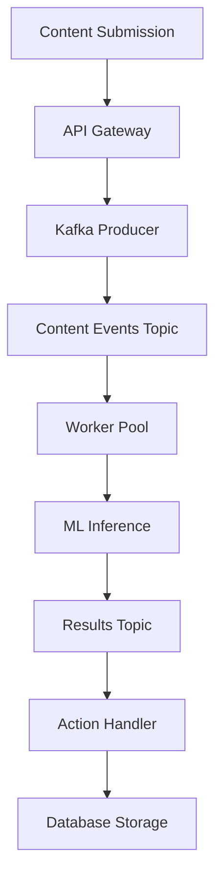

# Technical Architecture

## System Design Overview

The Distributed Abuse Detection System follows a microservices architecture pattern optimized for high-throughput, low-latency content moderation. The system is designed to process millions of content events daily while maintaining sub-100ms processing latency.

## 🏗️ Architectural Patterns

### Event-Driven Architecture
The system leverages event-driven patterns to ensure loose coupling and high scalability:



### Microservices Decomposition

#### 1. **Ingestion Service**
```typescript
interface ContentEvent {
  id: string;
  userId: string;
  contentType: 'text' | 'image' | 'audio';
  content: string | Buffer;
  metadata: {
    timestamp: Date;
    source: string;
    priority: 'high' | 'normal' | 'low';
  };
}
```

**Responsibilities:**
- Request validation and authentication
- Rate limiting per user/IP
- Content preprocessing and normalization
- Event publishing to Kafka

**Scaling Strategy:**
- Stateless horizontal scaling
- Load balancer with sticky sessions disabled
- Auto-scaling based on CPU and request queue depth

#### 2. **Text Moderation Worker**
```javascript
const toxicity = require('@tensorflow-models/toxicity');

class TextModerationWorker {
  async processContent(event) {
    const predictions = await this.model.classify([event.content]);
    return {
      contentId: event.id,
      predictions: predictions.map(p => ({
        label: p.label,
        confidence: p.results[0].probabilities[1]
      })),
      action: this.determineAction(predictions)
    };
  }
}
```

**Key Features:**
- TensorFlow.js toxicity model integration
- Multi-language support with language detection
- Confidence-based flagging thresholds
- Batch processing for improved throughput

#### 3. **Image Moderation Worker**
```go
package main

import (
    "github.com/microsoft/onnxruntime-go"
)

type ImageModerationWorker struct {
    session *onnxruntime.Session
}

func (w *ImageModerationWorker) ProcessImage(imageData []byte) (*ModerationResult, error) {
    // Preprocess image
    tensor := w.preprocessImage(imageData)
    
    // Run inference
    output, err := w.session.Run(map[string]interface{}{
        "input": tensor,
    })
    
    return w.parseResults(output), err
}
```

**Capabilities:**
- NSFW content detection
- Violence and harmful imagery classification
- Object detection for prohibited items
- Face detection and analysis

#### 4. **Audio Moderation Worker**
```javascript
class AudioModerationWorker {
  async processAudio(audioBuffer) {
    // Speech-to-text conversion
    const transcript = await this.speechToText(audioBuffer);
    
    // Audio classification (screaming, violence, etc.)
    const audioFeatures = await this.extractAudioFeatures(audioBuffer);
    
    // Combined analysis
    const textResult = await this.analyzeText(transcript);
    const audioResult = await this.classifyAudio(audioFeatures);
    
    return this.combineResults(textResult, audioResult);
  }
}
```

## 🔄 Data Flow Architecture

### Message Flow Diagram
```
┌─────────────┐    ┌─────────────┐    ┌─────────────┐
│   Client    │───▶│ API Gateway │───▶│   Kafka     │
└─────────────┘    └─────────────┘    │  Producer   │
                                      └─────────────┘
                                             │
                                             ▼
┌─────────────────────────────────────────────────────────────┐
│                    Kafka Cluster                           │
│  ┌─────────────┐ ┌─────────────┐ ┌─────────────┐         │
│  │   Topic:    │ │   Topic:    │ │   Topic:    │         │
│  │raw-content  │ │ moderation  │ │   actions   │         │
│  └─────────────┘ └─────────────┘ └─────────────┘         │
└─────────────────────────────────────────────────────────────┘
                                             │
                                             ▼
┌─────────────────────────────────────────────────────────────┐
│                  Worker Pools                              │
│  ┌─────────────┐ ┌─────────────┐ ┌─────────────┐         │
│  │    Text     │ │   Image     │ │   Audio     │         │
│  │  Workers    │ │  Workers    │ │  Workers    │         │
│  └─────────────┘ └─────────────┘ └─────────────┘         │
└─────────────────────────────────────────────────────────────┘
                                             │
                                             ▼
┌─────────────┐    ┌─────────────┐    ┌─────────────┐
│ PostgreSQL  │    │   Redis     │    │ Monitoring  │
│  Database   │    │   Cache     │    │   Stack     │
└─────────────┘    └─────────────┘    └─────────────┘
```

### Topic Configuration
```yaml
# Kafka Topics Configuration
topics:
  raw-content:
    partitions: 12
    replication-factor: 3
    retention.ms: 86400000  # 24 hours
    compression.type: snappy
    
  moderation-results:
    partitions: 12
    replication-factor: 3
    retention.ms: 604800000  # 7 days
    
  actions:
    partitions: 6
    replication-factor: 3
    retention.ms: 2592000000  # 30 days
```

## 🗄️ Data Architecture

### Database Schema
```sql
-- Content moderation results
CREATE TABLE moderation_results (
    id UUID PRIMARY KEY DEFAULT gen_random_uuid(),
    content_id VARCHAR(255) NOT NULL,
    user_id VARCHAR(255) NOT NULL,
    content_type VARCHAR(50) NOT NULL,
    moderation_status VARCHAR(50) NOT NULL,
    confidence_score DECIMAL(5,4),
    flags JSONB,
    created_at TIMESTAMP DEFAULT NOW(),
    updated_at TIMESTAMP DEFAULT NOW()
);

-- Audit logs
CREATE TABLE audit_logs (
    id UUID PRIMARY KEY DEFAULT gen_random_uuid(),
    content_id VARCHAR(255) NOT NULL,
    action VARCHAR(100) NOT NULL,
    reason TEXT,
    moderator_id VARCHAR(255),
    automated BOOLEAN DEFAULT true,
    created_at TIMESTAMP DEFAULT NOW()
);

-- Performance metrics
CREATE TABLE performance_metrics (
    id UUID PRIMARY KEY DEFAULT gen_random_uuid(),
    worker_type VARCHAR(50) NOT NULL,
    processing_time_ms INTEGER NOT NULL,
    queue_depth INTEGER,
    timestamp TIMESTAMP DEFAULT NOW()
);
```

### Redis Data Structures
```redis
# Rate limiting (Token bucket)
SETEX rate_limit:user:12345 3600 100

# Model configuration cache
HSET model:config:text threshold 0.85 version "v1.2.0"

# Worker health status
SETEX worker:health:text-worker-1 30 "healthy"

# Distributed locks
SET lock:model:update:text "worker-1" EX 300 NX
```

## 🚀 Scaling Strategies

### Horizontal Pod Autoscaling
```yaml
apiVersion: autoscaling/v2
kind: HorizontalPodAutoscaler
metadata:
  name: text-worker-hpa
spec:
  scaleTargetRef:
    apiVersion: apps/v1
    kind: Deployment
    name: text-worker
  minReplicas: 3
  maxReplicas: 50
  metrics:
  - type: Resource
    resource:
      name: cpu
      target:
        type: Utilization
        averageUtilization: 70
  - type: Pods
    pods:
      metric:
        name: kafka_consumer_lag
      target:
        type: AverageValue
        averageValue: "100"
```

### Custom Metrics Scaling
```yaml
# KEDA ScaledObject for Kafka-based scaling
apiVersion: keda.sh/v1alpha1
kind: ScaledObject
metadata:
  name: kafka-scaledobject
spec:
  scaleTargetRef:
    name: content-processor
  triggers:
  - type: kafka
    metadata:
      bootstrapServers: kafka:9092
      consumerGroup: content-processors
      topic: raw-content
      lagThreshold: '10'
```

## 🔧 Service Mesh Architecture

### Istio Configuration
```yaml
apiVersion: networking.istio.io/v1alpha3
kind: VirtualService
metadata:
  name: moderation-api
spec:
  http:
  - match:
    - headers:
        content-type:
          regex: "application/json"
    route:
    - destination:
        host: api-gateway
        subset: v1
      weight: 90
    - destination:
        host: api-gateway
        subset: v2
      weight: 10
    timeout: 30s
    retries:
      attempts: 3
      perTryTimeout: 10s
```

### Circuit Breaker Pattern
```javascript
const CircuitBreaker = require('opossum');

const options = {
  timeout: 3000,
  errorThresholdPercentage: 50,
  resetTimeout: 30000
};

const breaker = new CircuitBreaker(callMLService, options);

breaker.on('open', () => {
  console.log('Circuit breaker opened - falling back to cached results');
});
```

## 📊 Performance Optimizations

### Connection Pooling
```javascript
// PostgreSQL connection pool
const pool = new Pool({
  host: process.env.DB_HOST,
  port: process.env.DB_PORT,
  database: process.env.DB_NAME,
  user: process.env.DB_USER,
  password: process.env.DB_PASSWORD,
  max: 20,
  idleTimeoutMillis: 30000,
  connectionTimeoutMillis: 2000,
});

// Redis connection pool
const redis = new Redis.Cluster([
  { host: 'redis-1', port: 6379 },
  { host: 'redis-2', port: 6379 },
  { host: 'redis-3', port: 6379 }
], {
  enableOfflineQueue: false,
  maxRetriesPerRequest: 3,
  lazyConnect: true
});
```

### Batch Processing
```javascript
class BatchProcessor {
  constructor(batchSize = 32, maxWaitTime = 100) {
    this.batchSize = batchSize;
    this.maxWaitTime = maxWaitTime;
    this.buffer = [];
    this.timer = null;
  }

  async process(item) {
    this.buffer.push(item);
    
    if (this.buffer.length >= this.batchSize) {
      return this.flush();
    }
    
    if (!this.timer) {
      this.timer = setTimeout(() => this.flush(), this.maxWaitTime);
    }
  }

  async flush() {
    if (this.timer) {
      clearTimeout(this.timer);
      this.timer = null;
    }
    
    const batch = this.buffer.splice(0);
    return this.processBatch(batch);
  }
}
```

## 🔐 Security Architecture

### Authentication & Authorization
```yaml
apiVersion: security.istio.io/v1beta1
kind: AuthorizationPolicy
metadata:
  name: moderation-api-authz
spec:
  selector:
    matchLabels:
      app: api-gateway
  rules:
  - from:
    - source:
        principals: ["cluster.local/ns/default/sa/client-service"]
  - to:
    - operation:
        methods: ["POST"]
        paths: ["/api/v1/moderate"]
```

### Data Encryption
```javascript
// Content encryption before storage
const crypto = require('crypto');

function encryptContent(content, key) {
  const iv = crypto.randomBytes(16);
  const cipher = crypto.createCipher('aes-256-gcm', key, iv);
  
  let encrypted = cipher.update(content, 'utf8', 'hex');
  encrypted += cipher.final('hex');
  
  const authTag = cipher.getAuthTag();
  
  return {
    encrypted,
    iv: iv.toString('hex'),
    authTag: authTag.toString('hex')
  };
}
```

This architecture ensures high availability, scalability, and security while maintaining the performance requirements for real-time content moderation at enterprise scale. 