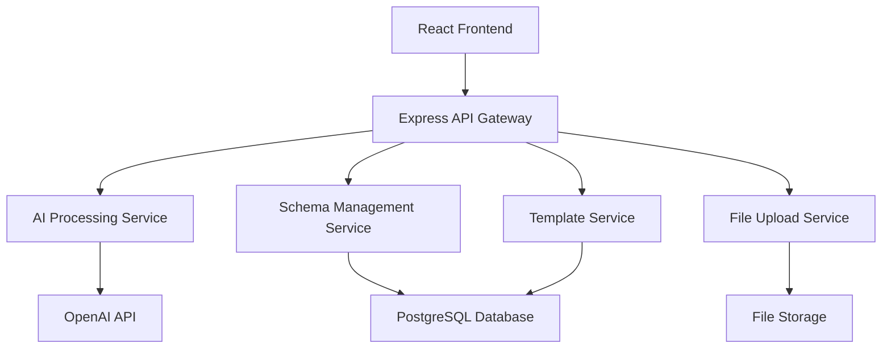

# Technical Architecture - Template Generator

> **Deep dive into the sophisticated system design that powers AI-driven form generation**

## 🏗️ System Overview

Template Generator employs a modern, scalable architecture that seamlessly integrates AI processing with real-time form generation. The system is designed for high performance, maintainability, and extensibility.



## 🎯 Architecture Principles

### **Microservices Design**
- **Separation of Concerns**: Each service handles a specific domain
- **Scalable Components**: Independent scaling based on load patterns
- **Fault Isolation**: Service failures don't cascade across the system

### **Event-Driven Processing**
- **Async Operations**: Non-blocking AI processing for better UX
- **Real-Time Updates**: WebSocket connections for live form previews
- **Queue Management**: Background processing for heavy operations

## 🔧 Frontend Architecture

### **React Component Hierarchy**

```typescript
// Component Architecture
App
├── Layout
│   ├── Header
│   ├── Navigation
│   └── Footer
├── Pages
│   ├── UploadPage
│   ├── SchemaEditor
│   ├── FormPreview
│   └── TemplateLibrary
└── Shared
    ├── FileUploader
    ├── SchemaBuilder
    ├── FormRenderer
    └── LoadingStates
```

### **State Management Strategy**

```typescript
// Redux Store Structure
interface AppState {
  upload: {
    file: File | null;
    progress: number;
    status: 'idle' | 'uploading' | 'processing' | 'complete';
  };
  schema: {
    generated: JSONSchema7;
    modified: JSONSchema7;
    validation: ValidationResult[];
  };
  forms: {
    preview: FormData;
    templates: Template[];
    activeTemplate: string | null;
  };
  ui: {
    activeTab: string;
    notifications: Notification[];
    loading: LoadingState;
  };
}
```

### **Component Design Patterns**

```typescript
// Custom Hooks for Business Logic
const useSchemaGeneration = () => {
  const [schema, setSchema] = useState<JSONSchema7>();
  const [loading, setLoading] = useState(false);
  const [error, setError] = useState<string | null>(null);

  const generateSchema = useCallback(async (file: File) => {
    setLoading(true);
    try {
      const result = await apiClient.generateSchema(file);
      setSchema(result.schema);
    } catch (err) {
      setError(err.message);
    } finally {
      setLoading(false);
    }
  }, []);

  return { schema, loading, error, generateSchema };
};

// Higher-Order Components for Common Functionality
const withErrorBoundary = <P extends object>(
  Component: React.ComponentType<P>
) => {
  return (props: P) => (
    <ErrorBoundary>
      <Component {...props} />
    </ErrorBoundary>
  );
};
```

## ⚙️ Backend Architecture

### **Service Layer Design**

```typescript
// Service Architecture
interface ISchemaService {
  generateFromExcel(file: Buffer): Promise<JSONSchema7>;
  validateSchema(schema: JSONSchema7): Promise<ValidationResult>;
  saveSchema(schema: JSONSchema7, metadata: SchemaMetadata): Promise<string>;
}

interface ITemplateService {
  createTemplate(name: string, schema: JSONSchema7): Promise<Template>;
  getTemplates(userId: string): Promise<Template[]>;
  updateTemplate(id: string, updates: Partial<Template>): Promise<Template>;
}

interface IAIService {
  analyzeExcelStructure(data: ExcelData): Promise<FieldAnalysis[]>;
  generateFieldTypes(columns: string[]): Promise<TypeMapping>;
  optimizeSchema(schema: JSONSchema7): Promise<JSONSchema7>;
}
```

### **Database Schema Design**

```sql
-- Core Tables
CREATE TABLE templates (
    id UUID PRIMARY KEY DEFAULT gen_random_uuid(),
    name VARCHAR(255) NOT NULL,
    description TEXT,
    schema JSONB NOT NULL,
    metadata JSONB,
    created_at TIMESTAMP DEFAULT NOW(),
    updated_at TIMESTAMP DEFAULT NOW(),
    created_by VARCHAR(255),
    version INTEGER DEFAULT 1
);

CREATE TABLE schemas (
    id UUID PRIMARY KEY DEFAULT gen_random_uuid(),
    template_id UUID REFERENCES templates(id),
    content JSONB NOT NULL,
    validation_rules JSONB,
    ui_schema JSONB,
    created_at TIMESTAMP DEFAULT NOW()
);

CREATE TABLE form_submissions (
    id UUID PRIMARY KEY DEFAULT gen_random_uuid(),
    template_id UUID REFERENCES templates(id),
    form_data JSONB NOT NULL,
    submitted_at TIMESTAMP DEFAULT NOW(),
    submitted_by VARCHAR(255)
);

-- Indexes for Performance
CREATE INDEX idx_templates_created_by ON templates(created_by);
CREATE INDEX idx_templates_updated_at ON templates(updated_at);
CREATE INDEX idx_schemas_template_id ON schemas(template_id);
CREATE GIN INDEX idx_templates_schema ON templates USING gin(schema);
```

### **API Design Patterns**

```typescript
// RESTful API Structure
const apiRoutes = {
  // File Operations
  'POST /api/v1/upload': uploadFile,
  'GET /api/v1/files/:id': getFile,
  
  // Schema Management
  'POST /api/v1/schemas/generate': generateSchema,
  'PUT /api/v1/schemas/:id': updateSchema,
  'GET /api/v1/schemas/:id/validate': validateSchema,
  
  // Template Operations
  'GET /api/v1/templates': getTemplates,
  'POST /api/v1/templates': createTemplate,
  'PUT /api/v1/templates/:id': updateTemplate,
  'DELETE /api/v1/templates/:id': deleteTemplate,
  
  // Form Operations
  'POST /api/v1/forms/preview': previewForm,
  'POST /api/v1/forms/submit': submitForm,
  'GET /api/v1/forms/:templateId/submissions': getSubmissions
};
```

## 🤖 AI Integration Architecture

### **OpenAI Processing Pipeline**

```typescript
// AI Processing Flow
class AIProcessor {
  async processExcelFile(file: Buffer): Promise<SchemaResult> {
    // 1. Parse Excel data
    const excelData = await this.parseExcel(file);
    
    // 2. Analyze structure with AI
    const analysis = await this.analyzeWithOpenAI(excelData);
    
    // 3. Generate JSON schema
    const schema = await this.generateSchema(analysis);
    
    // 4. Optimize and validate
    const optimizedSchema = await this.optimizeSchema(schema);
    
    return {
      schema: optimizedSchema,
      confidence: analysis.confidence,
      suggestions: analysis.suggestions
    };
  }

  private async analyzeWithOpenAI(data: ExcelData): Promise<Analysis> {
    const prompt = this.buildAnalysisPrompt(data);
    const response = await openai.chat.completions.create({
      model: "gpt-4",
      messages: [
        {
          role: "system",
          content: "You are an expert data analyst..."
        },
        {
          role: "user",
          content: prompt
        }
      ],
      temperature: 0.1,
      max_tokens: 2000
    });
    
    return this.parseAIResponse(response);
  }
}
```

### **Intelligent Field Detection**

```typescript
// AI-Powered Field Analysis
interface FieldAnalysis {
  name: string;
  type: 'string' | 'number' | 'boolean' | 'date' | 'email' | 'phone';
  required: boolean;
  validation: ValidationRule[];
  description: string;
  examples: string[];
  confidence: number;
}

class FieldAnalyzer {
  async analyzeField(
    columnName: string, 
    sampleData: string[]
  ): Promise<FieldAnalysis> {
    const patterns = this.detectPatterns(sampleData);
    const aiInsights = await this.getAIInsights(columnName, sampleData);
    
    return {
      name: this.normalizeFieldName(columnName),
      type: this.determineType(patterns, aiInsights),
      required: this.assessRequirement(sampleData),
      validation: this.generateValidation(patterns),
      description: aiInsights.description,
      examples: sampleData.slice(0, 3),
      confidence: aiInsights.confidence
    };
  }
}
```

## 🔄 Data Flow Architecture

### **Request Processing Flow**

```typescript
// End-to-End Data Flow
const processUploadRequest = async (req: Request, res: Response) => {
  try {
    // 1. File Upload & Validation
    const file = await fileService.validateAndStore(req.file);
    
    // 2. Queue AI Processing
    const jobId = await queueService.enqueue('schema-generation', {
      fileId: file.id,
      userId: req.user.id
    });
    
    // 3. Return Job ID for tracking
    res.json({ jobId, status: 'processing' });
    
    // 4. Background Processing
    await processSchemaGeneration(jobId, file);
    
  } catch (error) {
    await errorHandler.handle(error, req, res);
  }
};

// Background Processing
const processSchemaGeneration = async (jobId: string, file: File) => {
  try {
    // AI Processing
    const schema = await aiService.generateSchema(file);
    
    // Store Results
    await schemaService.save(schema, { jobId, fileId: file.id });
    
    // Notify Client
    await websocketService.emit(jobId, {
      type: 'schema-complete',
      schema,
      timestamp: new Date()
    });
    
  } catch (error) {
    await websocketService.emit(jobId, {
      type: 'schema-error',
      error: error.message,
      timestamp: new Date()
    });
  }
};
```

## 🚀 Performance Optimizations

### **Frontend Optimizations**

```typescript
// Code Splitting & Lazy Loading
const SchemaEditor = lazy(() => import('./components/SchemaEditor'));
const FormPreview = lazy(() => import('./components/FormPreview'));

// Memoization for Expensive Operations
const MemoizedFormRenderer = React.memo(FormRenderer, (prev, next) => {
  return JSON.stringify(prev.schema) === JSON.stringify(next.schema);
});

// Virtual Scrolling for Large Forms
const VirtualizedFormFields = ({ fields }: { fields: FormField[] }) => {
  return (
    <FixedSizeList
      height={600}
      itemCount={fields.length}
      itemSize={80}
      itemData={fields}
    >
      {FieldRenderer}
    </FixedSizeList>
  );
};
```

### **Backend Optimizations**

```typescript
// Database Query Optimization
class TemplateRepository {
  async getTemplatesWithPagination(
    userId: string, 
    page: number, 
    limit: number
  ): Promise<PaginatedResult<Template>> {
    const query = `
      SELECT t.*, COUNT(*) OVER() as total_count
      FROM templates t
      WHERE t.created_by = $1
      ORDER BY t.updated_at DESC
      LIMIT $2 OFFSET $3
    `;
    
    const result = await this.db.query(query, [
      userId, 
      limit, 
      (page - 1) * limit
    ]);
    
    return {
      data: result.rows,
      total: result.rows[0]?.total_count || 0,
      page,
      limit
    };
  }
}

// Caching Strategy
class CacheService {
  async getOrSet<T>(
    key: string, 
    fetcher: () => Promise<T>, 
    ttl: number = 3600
  ): Promise<T> {
    const cached = await this.redis.get(key);
    if (cached) {
      return JSON.parse(cached);
    }
    
    const data = await fetcher();
    await this.redis.setex(key, ttl, JSON.stringify(data));
    return data;
  }
}
```

## 🔒 Security Architecture

### **Authentication & Authorization**

```typescript
// JWT-based Authentication
interface AuthMiddleware {
  authenticate: (req: Request, res: Response, next: NextFunction) => void;
  authorize: (roles: string[]) => Middleware;
}

// Rate Limiting
const rateLimiter = rateLimit({
  windowMs: 15 * 60 * 1000, // 15 minutes
  max: 100, // limit each IP to 100 requests per windowMs
  message: 'Too many requests from this IP'
});

// Input Validation
const validateSchema = [
  body('name').isLength({ min: 1, max: 255 }).trim().escape(),
  body('schema').isJSON().custom(validateJSONSchema),
  body('description').optional().isLength({ max: 1000 }).trim().escape()
];
```

This architecture ensures Template Generator is not just functional, but scalable, maintainable, and ready for enterprise deployment. Every component is designed with performance, security, and user experience in mind.

---

*System designed and implemented by Mohanpathi - March 2025* 